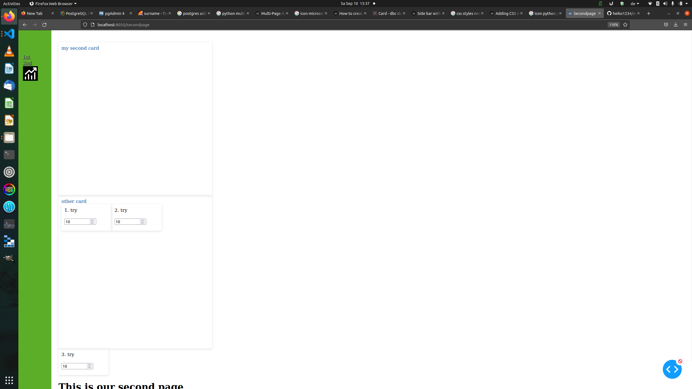

# Dashapp Experimentals

This Repo is for testing and developing new things. 

It is very basic for a multi page App using CSS and some cards

Nothing special. 





```bash

python3 -m venv .venv

# switch manually to virtual environment and then

$(.venv) python3 -m pip install --upgrade pip

$(.venv) pip install poetry

$(.venv) poetry install 
# will install all dependencies from the pyproject.toml file

```


